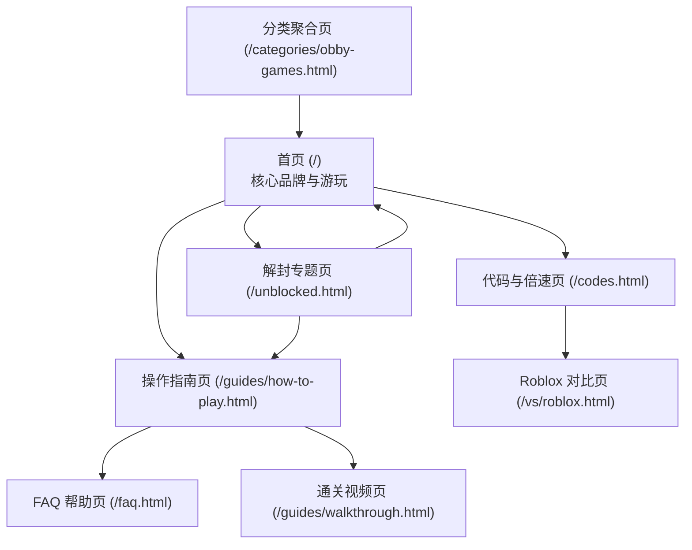

# Slime Keyboard Escape - SEO 友好的网站结构与 URL 规划方案

本方案完全基于项目已清洗整理的 `keyword_plan.md` 关键词、搜索量与搜索意图，按照哥飞 SEO 教程的网站架构方法规划完成。

---

## 一、 页面类型与职责划分 (Page Types & Responsibilities)

在本项目（HTML5 游戏站 / 微型工具站）中，四类页面各自承担明确的 SEO 与用户转化职责：

| 页面类型 | 核心职责与分工 | 解决的用户需求 |
| :--- | :--- | :--- |
| **1. 首页 (Homepage)** | 全站品牌形象展现、核心游戏即刻游玩入口、总导航与全站内链枢纽。 | 承接品牌主词，让用户点击进来 3 秒内就能开始游戏。 |
| **2. 栏目页 / 专题中心 (Category/Hub Pages)** | 按**搜索场景（如 Unblocked 场景）**和**游戏大类（如 Obby 跑酷大类）**进行分门别类，传递权重。 | 满足特定场景（学校解封）或特定类别探索的用户，便于谷歌理解网站主题分类。 |
| **3. 游玩/功能页 (Play/Tool Pages)** | 提供特定玩法模式、功能版块（如 1-Speed 倍速模式、Roblox 对比、Codes 礼包码）。 | 满足具体的高意图功能需求，直接提供操作与互动。 |
| **4. 内容/攻略页 (Content/Guide Pages)** | 提供详细的图文操作指南、按键映射、故障排查与关卡通关技巧。 | 解决玩家卡关、按键失效求助等信息类 (Informational) 搜索，捕获长尾问答流量。 |

---

## 二、 完整 URL 结构与页面明细表 (URL List & Priorities)

### 🔴 第一批做 (Phase 1: 核心必备 5 大页面)
*目标：优先上线覆盖 80% 以上的核心搜索流量与高暴发 Unblocked 需求。*

#### 1. 首页 (Homepage)
* **建议 URL**：`https://slimekeyboardescape.com/` (或 `/index.html`)
* **主关键词**：`Slime Keyboard Escape`
* **次要关键词**：`Play Slime Keyboard Escape Online`, `Free Slime Keyboard Game`, `HTML5 Browser Game`
* **页面用途**：承接品牌流量与主游戏入口。顶部为即玩 Game Frame，下方搭配游戏亮点介绍、控制快捷键预览与核心 FAQ。
* **合并覆盖**：合并了 `online`, `free`, `game`, `pc`, `website` 等同义词，**无需单独建立 /free.html 或 /online.html**。

#### 2. Unblocked 场景专题页 (Unblocked Hub Page)
* **建议 URL**：`https://slimekeyboardescape.com/unblocked.html`
* **主关键词**：`Slime Keyboard Escape Unblocked`
* **次要关键词**：`Slime Keyboard Escape GitHub`, `Classroom 6x Alternative`, `Unblocked Games 76`, `Chromebook Unblocked Game`
* **页面用途**：专门面向学校/工作受限网络。使用纯极简无阻碍静态 HTML，强调“Chromebook 100% 流畅支持、无封锁、免安装”。
* **合并覆盖**：将 `github`, `classroom 6x`, `unblocked 76`, `unblocked 66`, `chromebook` 集中在同一个页面用 H2/H3 小标题覆盖，**避免拆分成多个相似的薄页面**。

#### 3. 玩法与操作指南页 (How to Play & Controls Guide)
* **建议 URL**：`https://slimekeyboardescape.com/guides/how-to-play.html`
* **主关键词**：`Slime Keyboard Escape Controls`
* **次要关键词**：`How to play Slime Keyboard Escape`, `Slime Keyboard Escape Key Binding`, `WASD Controls`
* **页面用途**：提供精美的图文按键映射图表（WASD / 方向键 / Space 跳跃），详细讲解按键踩压技巧与游戏核心机制。

#### 4. 代码与 1 倍速模式页 (Codes & 1-Speed Mode Page)
* **建议 URL**：`https://slimekeyboardescape.com/codes.html`
* **主关键词**：`Keyboard Escape Codes`
* **次要关键词**：`1 Speed Slime Keyboard Escape`, `Plus 1 Speed Keyboard Escape Codes`, `Promo Codes`
* **页面用途**：承接搜索 Roblox 版礼包代码 (Codes) 和 "+1 Speed" 模式的高热流量。提供最新代码列表与“1 倍速/极速模式”网页版游玩选项。

#### 5. 故障排查与 FAQ 帮助页 (Troubleshooting & FAQ Page)
* **建议 URL**：`https://slimekeyboardescape.com/faq.html`
* **主关键词**：`Slime Keyboard Escape Key Not Working`
* **次要关键词**：`Slime Keyboard Escape Not Loading`, `Chromebook Keyboard Fix`, `Browser Focus Issue`
* **页面用途**：专门解决玩家反馈的“按键没反应”、“网页焦点丢失”等问题。植入 JSON-LD FAQ 结构化数据，争取 Google 搜索结果的 Rich Snippets 问答展位。

---

### 🟡 第二批做 (Phase 2: 拓展与分类 4 大页面)
*目标：在网站有基础收录后上线，扩大搜索词包与同类游戏流量。*

#### 6. Roblox 平台版本对比与落地页 (Roblox vs Web Page)
* **建议 URL**：`https://slimekeyboardescape.com/vs/roblox.html`
* **主关键词**：`Roblox Keyboard Escape`
* **次要关键词**：`Keyboard Escape No Roblox Needed`, `Browser Version vs Roblox`
* **页面用途**：面向搜索 Roblox 版玩家，强调“无需下载庞大的 Roblox 客户端，在浏览器点开即可免登录游玩”。

#### 7. 通关视频与关卡攻略页 (Walkthrough & Levels Guide)
* **建议 URL**：`https://slimekeyboardescape.com/guides/walkthrough.html`
* **主关键词**：`Slime Keyboard Escape Walkthrough`
* **次要关键词**：`Slime Keyboard Escape Level Walkthrough`, `Speedrun Guide`, `Video Solution`
* **页面用途**：嵌入通关全流程视频与高难机关避坑图文说明，吸引寻求卡关帮助的高停留时间玩家。

#### 8. Obby 障碍跑酷分类页 (Obby Games Category Page)
* **建议 URL**：`https://slimekeyboardescape.com/categories/obby-games.html`
* **主关键词**：`Obby Games`
* **次要关键词**：`Keyboard Obby Games`, `Obstacle Course Games`, `Unblocked Obby`
* **页面用途**：借鉴 Poki / CrazyGames 分类架构，将本游戏归入热门的 Obby (障碍跑酷) 标签，推荐相关跑酷小游戏。

#### 9. 键盘操控小游戏分类页 (Typing & Keyboard Games Category)
* **建议 URL**：`https://slimekeyboardescape.com/categories/typing-games.html`
* **主关键词**：`Keyboard Games`
* **次要关键词**：`Typing Games`, `One Button Games`, `Skill Games`
* **页面用途**：建立键盘技能类小游戏聚合专区，方便长尾流量在站内循环留存。

---

## 三、 防重复与薄页面控制策略 (De-duplication Policy)

根据哥飞教程**“不要为了覆盖关键词重复生成高度相似页面”**的要求，本项目严格遵守以下 3 项规则：

1. **同义表达一律合并**：
   - ❌ **不做**：`/slime-keyboard-escape-free.html` 和 `/slime-keyboard-escape-online.html`
   - ✅ **做法**：统一收录在首页 `/index.html`，在首页 Meta Description 与 H2 中写入 "Play Free Online"。

2. **多解封节点归一**：
   - ❌ **不做**：`/unblocked-76.html`、`/unblocked-66.html`、`/classroom-6x.html` 等多个同质解封页。
   - ✅ **做法**：统一建立唯一高清解封页 `/unblocked.html`，在页面内设立段落说明兼容 76/66/Classroom 6x 搜索群体。

3. **控制与指南整合**：
   - ❌ **不做**：把 WASD 控制、方向键控制、空格跳跃拆分成多篇文章。
   - ✅ **做法**：整合为单页精良攻略 `/guides/how-to-play.html`，提供完整的控件与操作表。

---

## 四、 页面间内链互联架构 (Internal Linking Blueprint)

1. **首页 Footer & Header**：全站顶部导航与底部固定放置 `Play Game`、`Unblocked`、`How to Play`、`Codes` 4 个核心链接。
2. **Unblocked 页**：顶部醒目按钮导航回主游玩页，底部推荐“操作指南”。
3. **攻略页**：文章末尾放置“遇到按键没反应？查看 FAQ 解决方法”引流至 `/faq.html`。
